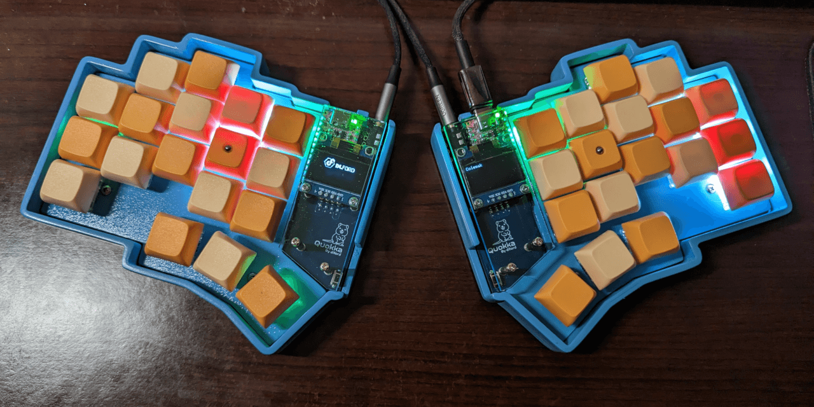

# Quokka Keyboard

## Features

- Designed for smaller handed folks
    - Steep columnar stagger
    - Slightly tucked in thumb cluster
- Per-key RGB Matrix using the easier to solder SK6812-MINI-E LEDs
- Piezo speakers
- 128x64 OLED displays
- TRRS jack faces back to keep your cables out of the way
- Full duplex serial connection between halves

## Parts List

**\* Affiliate Links**

- 36x MX keys
- 36x [Kailh MX Hot Swap Sockets](https://amzn.to/3pdbQfA)*
- 36x [D_0805 1N4148 Diodes](https://amzn.to/3pfWarV)*
- 2x [PJ-320A TRRS Jacks](https://amzn.to/3NHV4iI)*
- 2x [Adafruit KB2040 MCU](https://www.adafruit.com/product/5302)
- 8x [Stick-on Rubber Feet](https://amzn.to/3HISXHJ)*
- 2x [PTS636 SP43 LFS Reset Buttons](https://www.digikey.com/en/products/detail/c-k/PTS636-SP43-LFS/10071717) (Optional)
- 36x [SK6812-MINI-E RGB LEDs](https://www.diykeyboards.com/parts/product/sk6812-mini-e-rgb-led) (Optional)
- 2x [GME12864-49 OLED Displays](https://www.littlekeyboards.com/products/128x64-oled-screen) (Optional)
- 2x [KLJ-1102 Piezo Speakers](https://keeb.io/collections/diy-parts/products/piezo-speaker) (Optional)
- Screws and Stand-offs
    - M2x4mm screws for all standoffs
    - 10x M2x9mm screws for 3D printed case
    - 10x [M2x3mm heat set inserts](https://www.mcmaster.com/97163A146/) for 3D printed case
    - 2x M2x10mm stand-offs for OLED mounting
    - 2x M2x15mm stand-offs for OLED covers

## Build Guide

*Coming Soon!*